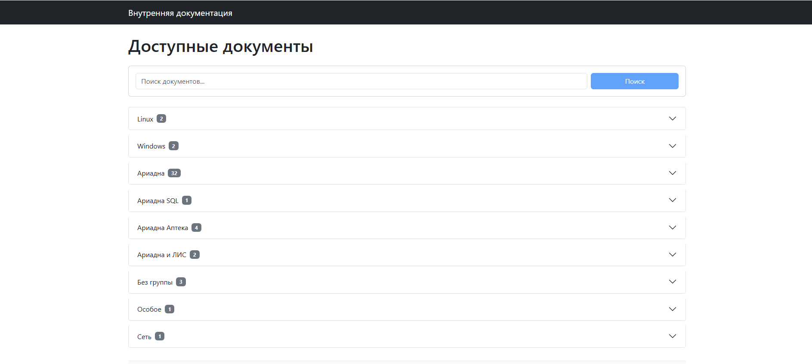
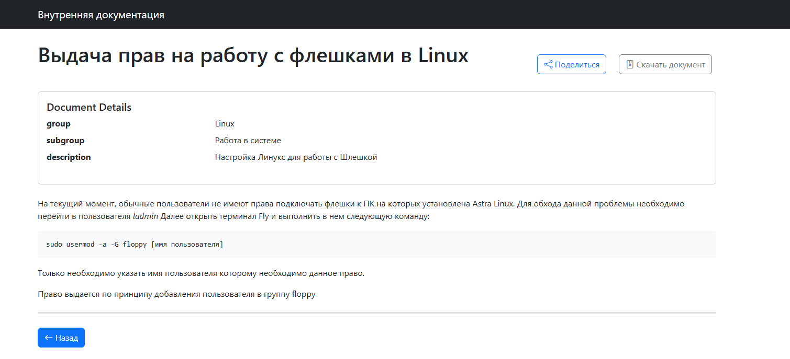
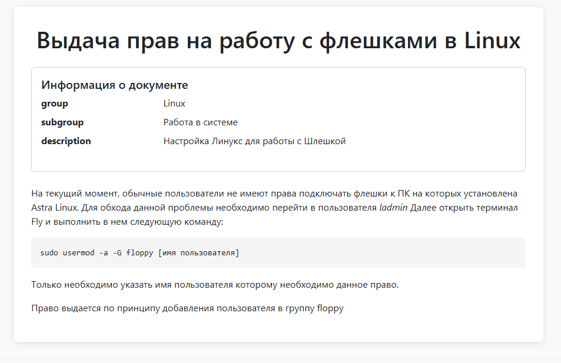

# Viewer Service для Obsidian

## Описание

Сервис позволяющий вытянуть md файлы из локального хранилища Obsidian.

## Особенности

- Просмотр Markdown-документов с поддержкой синтаксиса
- Группировка документов
- Активные ссылки на связанные документы
- Возможность установить пароль на документ
- Отображение встроенных изображений
- Скачивание прикрепленных файлов (exe, xlxs, bat и др.)
- Поиск по документам
- Не перегруженный интерфейс
- Возможность создания ссылок на изолированные страницы
- Логирование
- Просмотр изображений в приближении
- Проигрование Видеофайлов (Поддерживаемый формат `.mp4`)
- Подсветка синтаксиса Языков програмирования
    - Python
    - SQL

### Поддерживаемый синтаксис Markdown:
- Форматирование текста:
    - Жирный
    - Курсив
    - Зачеркнутый
    - Подчеркнутый
    - Выделение цветом
- Цитирование
- Таблицы
- Выделение блока кода
- Списки
- Разделители
- Ссылки
- Картинки
- Чекбоксы

## Интерфейс
Главная страница:


Страница просмотра документа:


Изолированный документ:


## Требования

- Python 3.13
- Установленные зависимости из `requirements.txt`

## Установка

1. Склонируйте репозиторий, и создайте в нем виртуальное окружение и перейдите в него
```bash
python -m venv viewer
.\viewer\Scripts\activate
```

2. Установите зависимости:
```bash
pip install -r requirements.txt
```

3. Указать значения в ENV Файл
> Смотреть ниже

## Запуск

``` bash
uvicorn app.main:app --host 0.0.0.0 --port 5031
```

Сервис будет доступен по адресу: `http://localhost:5031`

## env файл

> Пример `.env` файла лежит в репозитории под названием `env.txt`

1. В файле `.env` укажите путь до локального хранилища Obsidian 
```txt
CONTENT_DIR = Path("T:\\Sulima\\work-house")
```
2. Укажите название папки со всеми вложенными файлами
```txt
IMAGES_DIR = "Вложения"
```
3. Укажите название папки со всеми файлами MD
```txt
DOCUMENTS_DIR = "База знаний"
```
4. Укажите номер порта, на котром будет работать сервис, так как это необходимо для корректной работы всего сервиса.
```txt
PORT = 5031
```